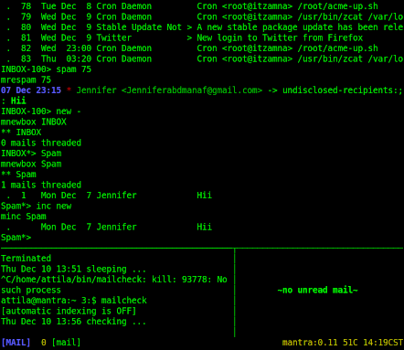

# Tooling for mblaze

I make no advertisements for these scripts except: they are generally
short and do one thing.  Well...

They enable my email workflow on top of mblaze(7).  I use
[tmux(1)](https://man.openbsd.org/tmux) as my UI toolkit, since it is
easy to integrate with on the command line and enables useful
interactions while hiding messy details (e.g. mouse support).  Several
scripts do things with tmux, either creating windows/panes or
reading/setting the main cutbuffer, where it is assumed there is a
msg# in the current sequence.  This means you can select a msg# with
the mouse in tmux and operate on it; not quite point-and-click but
close enough for me.  It also means that it's probably best to run
mb and friends in their own dedicated tmux session, which makes
them look kinda like a real MUA if you squint, but then I personally
prefer typing commands to navigating menus.

These scripts assume they are installed on a BSD system, or at least
one where the normal BSD utilities are available, including
[rs(1)](https://man.openbsd.org/rs),
[fmt(1)](https://man.openbsd.org/fmt),
[awk(1)](https://man.openbsd.org/awk), etc.  If you try this somewhere
other than OpenBSD you'll also have to make sure Perl is installed.

The mb script uses [rl](rl), a small Perl program included in this
package; it depends on the `Term::ReadLine::Gnu` Perl module being
installed and by default saves your mb command history in
`~/.mb.history`.  This can all be overridden in your configuration
(see below).

You should read mblaze(7) and the rest of the mblaze man pages if you
want to understand what is going on here; also, reading
[tmux(1)](https://man.openbsd.org/tmux) is not a terrible idea.

## Configuration

I pile on with mblaze and store configuration information in
`~/.mblaze/profile` in the form of text that looks like email headers;
this makes it easy to query the configuration with mblaze's mhdr(1)
utility.

Things you can set there:

* CryptFileCmd: command to store plaintext of an encrypted msg
* CryptTmp: temp dir to use in mdecrypt, preferably in a cryptofs
* Editor: editor command, overridden by $EDITOR envar if set
* EncryptCmd: command to encrypt a message (def: gpg)
* Inbox: full path to your main in-box
* InboxName: the relative path of your inbox under Maildir
* MaildirBase: the base directory of your maildir tree
* MdisplayOpts: default options to the mdisplay script
* MpaneLines: size in lines of pane mpane creates for mb
* MBStartQuiet: if set mb behaves as if -q was specified by default
* MBDefaultCmd: command to run when mb starts, def depends on options
* MBReadLineCmd: command to use to read a line in mb, def: rl
* MBHistoryFile: where to store your mb/rl history, def ~/.mb.history

It's probably better to set MaildirBase and InboxName and leave Inbox
alone but there are situations where you can't.  I generally run all
these tools in my home directory and use relative paths to name
folders.

If MBDefaultCmd is not set, then it defaults to minbox; if the `-n`
option is specified, then it defaults to mnewbox.

## Screenshot

Everyone loves a screenshot, so:

## Actual Use

Use at your own risk.  On a POSIX system.  Preferably OpenBSD.  I
store my maildir tree under ~/mail, and start this mess from inside of
tmux by running `mb -n` to see new messages in my in-box.  My
`~/.mblaze/profile` has the following two lines at the end:

    MaildirBase: /home/attila/mail
    InboxName: INBOX

I use [fdm](https://github.com/nicm/fdm) to fetch my mail and drop it
into various Maildrirs in my mail tree as it comes in; it's nice and
well-documented, FWIW.  I generally use the msummary script from
inside of fdm, to display a summary of what is happening as it goes by
in a tmux pane.

The mailcheck script that comes with this package is one way of
driving this process; it can be configured via `~/.mblaze/profile` but
defaults to doing what I do with fdm and mairix.  I leave it runing in
a tmux pane to show me when new messages arrive.

Likewise, the foldercheck script in this package displays a summary of
folders with new messages in them, I also leave it running in a tmux
pane to show me where new mail has been filed by fdm.

Both mailcheck and foldercheck can be safely interrupted and will also
respond to the SIGINFO signal (^T under BSD) by waking up if they are
sleeping and checking for new mail on the server/in local folders.

I also use [bmf](http://sourceforge.net/projects/bmf/) for last-gasp
client-side spam filtering, again via my fdm config.  The mspam and
munspam scripts tell bmf that a message was a false negative or
positive, respectively.  They aren't relevant to anyone who doesn't
use bmf.

A brief description of what these scripts do:

    mb          thin command-line loop to interact with mblaze
    mapply      apply our args as a command to each filename on stdin
    mdecrypt    given a liste of message numbers/sequences, decrypt them
    mdisplay    display a msgno in the tmux cut-buffer in another tmux window
    mencrypt    encrypt an outbound message using gnupg (not yet working)
    minbox      list your inbox in threaded form, set current msg sequence
    mincall     invoke minc on all directories with new mail
    mmv         given a destination folder in command line mv files on stdin
     mcp        like mmv but cp's files instead of mv'ing them (symlink -> mmv)
    mnewbox     show new messages in given folder
    mnewdirs    show all folders with new messages plus a count per folder
    mpane       run "mnewbox; mb" in a new tmux pane
    mrespam     mark messages on stdin as spam (false negative)
    mrm         like mmv but rm the messages on stdin
    msign       sign a message using gnupg (run from mcom(1))
     mencrypt   encrypt msg using gnupg (run from mcom(1)) (symlink -> msign)
    msummary    print colorized one-line summary of msg on stdin
    munspam     mark messages on stdin as not spam (false positive)
    foldercheck script I run in a small tmux pane to check for new mail
    mailcheck   script I run like foldercheck to fetch mail from servers
    rl          small Perl GNU ReadLine interface to give mb editing/history
